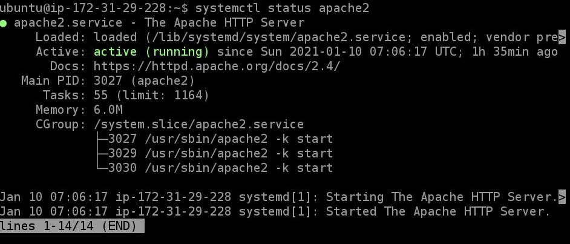

***How to install the Apache2 Web Server on Ubuntu [No setting up virtual host]***

First, we can upgrade packages or clean your packages using this command 

sudo apt update

Then install Apache2 Web Server using this command

sudo apt install apache2

You may see the question "Do you want to continue? [Y/n]" Type y and press Enter

After the installation, you can check the status of Apache2 using this command

sudo systemctl status apache2

Your input should be something like this :

This means our apache2 is active properly. 

Then you can open the web browser and type this command. (Put your IP address)

http://3.XX.XX.XX   

You will see this page. 

PICTURE

If the Apache2 Ubuntu Default Page appeared, that means you are doing right.

You will see that the page is telling we can replace the content in file located at /var/www/html/index.html/

To do that, first we can access into that directory using this command

cd /var/www/html/

Then use this command to check what all files are in this directory

ls

You will see this output which means in directory /var/www/html/, there exist a file name index.html

PICTURE

You can go ahead and edit that file usig this command

sudo nano index.html

But before beginning to edit our index.html file, I want copy our apache2 original file in order if anything goes wrong. So, go ahead and use this command

sudo cp index.html YourNewName (I used index_new.html for my new file, but you can custom it by yourself)

Next, you can go ahead and delete our original file as to access it and delete line by line would take a lot of time. 

sudo rm index.html

Now, when you use command 'ls' again, you will only see index_new.html file in /var/www/html/ directory

PICTURE

Go ahead and edit our original file using this command

sudo nano index.html 

*We can create new file and edit it by using 'sudo nano' command

Then you will see something like this. You can now begin editting the file.

PICTURE

After editting the file, you can save it by press Ctl+O. It will ask whether index.html is the file you wish to save this code. Press Enter, follow by Ctl+X to exit.

You can check if the code is saved by using this command to see what is present in the file

cat index.html

And that's it!!! You have finished editting the page. Open your web browser and type down your IP address.

 
  