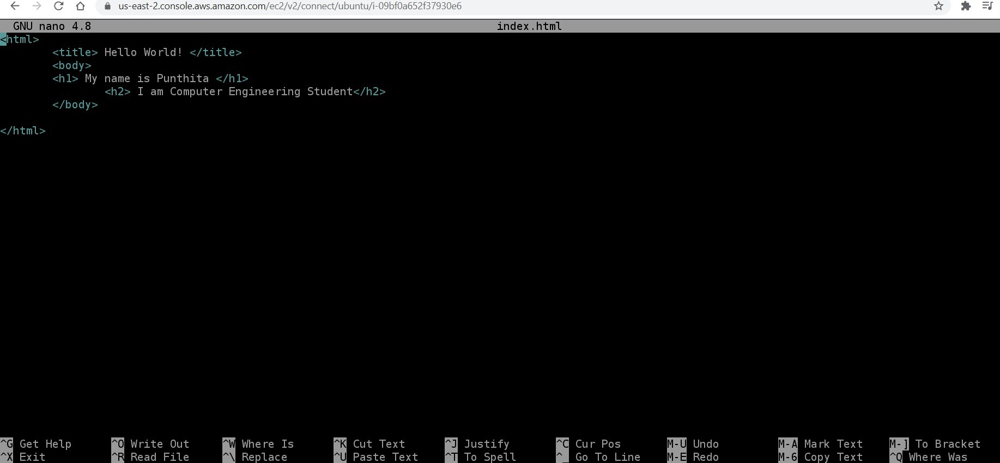
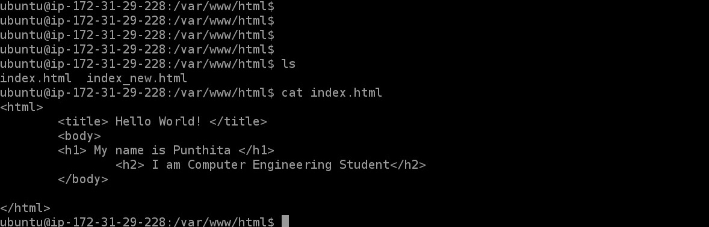
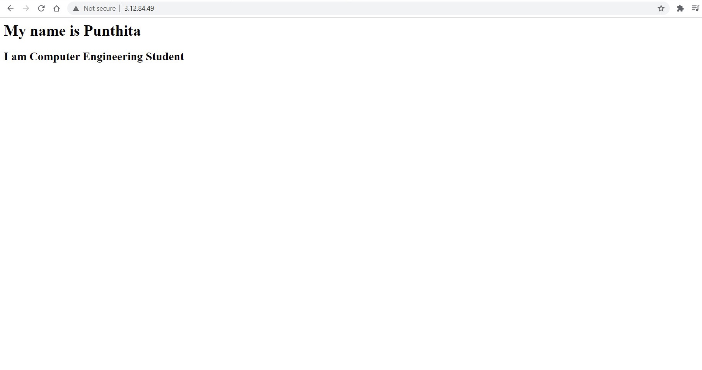

***How to install the Apache2 Web Server on Ubuntu [No setting up virtual host]***

First, we can upgrade packages or clean your packages using this command 

```ruby
sudo apt update
```

Then install Apache2 Web Server using this command

```ruby
sudo apt install apache2
```

You may see the question "Do you want to continue? [Y/n]" Type y and press Enter

After the installation, you can check the status of Apache2 using this command

```ruby
sudo systemctl status apache2
```

Your input should be something like this :

```ruby
● apache2.service - The Apache HTTP Server
   Loaded: loaded (/lib/systemd/system/apache2.service; enabled; vendor preset: enabled)
   Active: active (running) since Tue 2021-01-10 07:06:17 UTC; 10min ago
    Docs : https://httpd.apache.org/docs/2.4/
 Main PID: 3027 (apache2)
    Tasks: 55 (limit: 1164)
   Memory: 6.0M
   CGroup: /system.slice/apache2.service
           ├─3027 /usr/sbin/apache2 -k start
           ├─3029 /usr/sbin/apache2 -k start
           └─3030 /usr/sbin/apache2 -k start
```

This means our apache2 is active properly. 

Then you can open the web browser and type this command. ***Put your IP address***

```ruby
http://3.XX.XX.XX   
```

You will see this page. 


If the ***Apache2 Ubuntu Default Page*** appeared, that means you are doing right.

We can replace the content in file located at /var/www/html/index.html/

To do that, first we can access into that directory using this command

```ruby
cd /var/www/html/
```

Then use this command to check what all files are in this directory

```ruby
ls
```

You will see this output which means in directory /var/www/html/, there exist a file name index.html

You can go ahead and edit that file usig this command

```ruby
sudo nano index.html
```

But before beginning to edit our index.html file, I want copy our apache2 original file in order if anything goes wrong. So, go ahead and use this command

```ruby
sudo cp index.html NewFileName.html 
```

(I used index_new.html for my new file, but you can custom it by yourself)

Next, you can go ahead and delete our original file as to access it and delete line by line would take a lot of time. 

```ruby
sudo rm index.html
```

Now, when you use command 'ls' again, you will only see index_new.html file in /var/www/html/ directory

Go ahead and edit our original file using this command

```ruby
sudo nano index.html 
```



After editting the file, you can save it by press Ctl+O. It will ask whether index.html is the file you wish to save this code. Press Enter, follow by Ctl+X to exit.

You can check if the code is saved by using this command to see what is present in the file

```ruby
cat index.html
```


And that's it!!! You have finished editting the page. Open your web browser and type down your IP address.



 
  